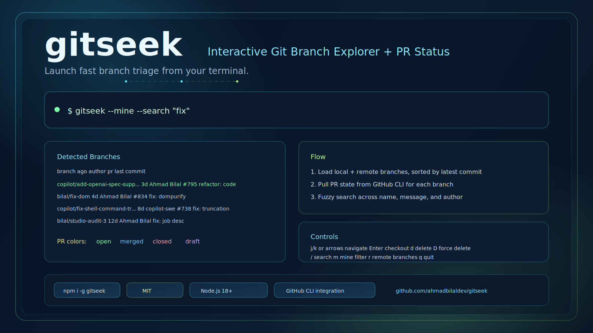

# gitseek

Interactive git branch explorer with GitHub PR status.



Browse, search, and manage git branches from a single interactive TUI — sorted by latest, filtered by author, with inline PR numbers and status via GitHub CLI.

## Install

```bash
npm install -g gitseek
```

## Usage

```bash
# Interactive mode
gitseek

# Short alias
gs

# Show only your branches (by commit author + PR assignee)
gitseek --mine

# Include remote branches
gitseek --all

# Pre-filter by search query
gitseek --search "feature"

# Non-interactive output
gitseek --print

# Combine flags
gitseek --mine --search "fix" --print
```

## Output

```
  BRANCH                          AGO     AUTHOR            PR    LAST COMMIT
  copilot/add-openai-spec-suppo…  3d      Ahmad Bilal       #795  refactor: code
  bilal/fix-dom                   4d      Ahmad Bilal       #834  fix: dompurify import
  copilot/fix-shell-command-tru…  8d      copilot-swe-age…  #738  fix: correct shell command…
  bilal/studio-audit-3            12d     Ahmad Bilal             fix: job description
```

Columns: `BRANCH`, `AGO` (compact — 3d, 2w, 4mo), `AUTHOR`, `PR` (color-coded by state), `LAST COMMIT`.

## Interactive Controls

`↑↓ navigate · Enter checkout · / search · m mine · r remote · d delete · D force-delete · q quit`

| Key | Action |
|---|---|
| `j` / `k` or arrows | Navigate up/down |
| `Enter` | Checkout selected branch |
| `d` | Delete branch (press twice to confirm) |
| `D` | Force delete branch |
| `m` | Toggle "my branches" filter |
| `r` | Toggle remote branches |
| `/` or `s` | Search branches |
| `Esc` | Clear search / exit |
| `q` | Quit |

## Features

- **Sorted by latest** — branches ordered by last commit date
- **Author filter** — `--mine` matches your `git config user.email` and GitHub PR assignees
- **Fuzzy search** — filter across branch name, commit message, and author
- **PR column** — dedicated column with PR numbers, color-coded by state (open, merged, closed, draft)
- **Compact dates** — `3d`, `2w`, `4mo` instead of verbose relative dates
- **Responsive layout** — branch names, authors, and messages truncate to fit terminal width
- **Quick actions** — checkout, delete, force-delete with keyboard shortcuts
- **Scrolling viewport** — handles repos with hundreds of branches
- **Print mode** — non-interactive output for scripting and piping

## Development

```bash
# Clone and install
git clone https://github.com/ahmadbilaldev/gitseek.git
cd gitseek
pnpm install

# Link globally for live testing
pnpm build
pnpm link --global

# Now `gitseek` and `gs` are available globally
# pointing to your local build

# Watch mode — auto-rebuilds on file changes
pnpm dev

# In another terminal, test your changes
gitseek --mine
```

After `pnpm link --global`, every `pnpm dev` rebuild is immediately reflected when you run `gitseek` — no reinstall needed.

To unlink when done:

```bash
pnpm unlink --global
```

## Requirements

- Node.js 18+
- Git
- [GitHub CLI](https://cli.github.com/) (`gh`) — optional, for PR column and assignee matching

## License

MIT
